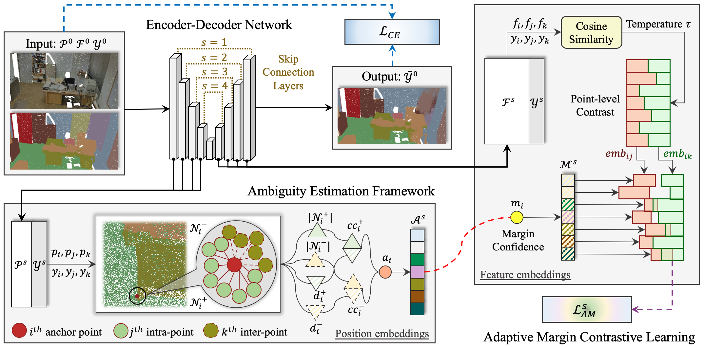

<div align="center">
<h1>Adaptive Margin Contrastive Learning<br>
for Ambiguity-aware 3D Semantic Segmentation</h1>

This repo is the official project repository of the papers: "[AMContrast3D](https://ieeexplore.ieee.org/document/10688017)" and "AMContrast3D++".


</div>

## Highlights

- **[2025.April.16]** Our paper AMContrast3D++ is accepted to **TMM**. ⭐
- **[2024.March.13]** Our paper AMContrast3D is accepted to **ICME 2024 [Oral]**. ⭐

## Overview

<div  align="center">    
 
</div>


Most existing methods use equally penalized objectives, which ignore the per-point ambiguities and less discriminated features stemming from transition regions. However, as highly ambiguous points may be indistinguishable even for humans, their manually annotated labels are less reliable, and hard constraints over these points would lead to sub-optimal models. To address this, we first design AMContrast3D, a method comprising contrastive learning into an ambiguity estimation framework, tailored to adaptive objectives for individual points based on ambiguity levels. As a result, our method promotes model training, which ensures the correctness of low-ambiguity points while allowing mistakes for high-ambiguity points. As ambiguities are formulated based on position discrepancies across labels, optimization during inference is constrained by the assumption that all unlabeled points are uniformly unambiguous, lacking ambiguity awareness. Inspired by the insight of joint training, we further propose AMContrast3D++ integrating with two branches trained in parallel, where a novel ambiguity prediction module concurrently learns point ambiguities from generated embeddings. To this end, we design a masked refinement mechanism that leverages predicted ambiguities to enable the ambiguous embeddings to be more reliable, thereby boosting segmentation performance and enhancing robustness. Experimental results on 3D indoor scene datasets, S3DIS and ScanNet, demonstrate the effectiveness of the proposed method.


## Installation

This code has been tested on Ubuntu 20.04 and two NVIDIA RTX 3090 GPUs. Please follow the requirements of [OpenPoints](https://github.com/guochengqian/PointNeXt/blob/master/docs/index.md) library to prepare the `openpoints` environment: 

```shell script
conda activate openpoints
cd AMContrast3D
```

## Dataset

`S3DIS` and `ScanNet` are required to be downloaded and unzipped to the `./data` folder.

Download `S3DIS` dataset for semantic segmentation task by running the following commands:

```shell script
mkdir -p data/S3DIS/
cd data/S3DIS
gdown https://drive.google.com/uc?id=1MX3ZCnwqyRztG1vFRiHkKTz68ZJeHS4Y
tar -xvf s3disfull.tar
```

Download `ScanNet` dataset for the semantic segmentation task by running the following commands:

```shell script
cd data
gdown https://drive.google.com/uc?id=1uWlRPLXocqVbJxPvA2vcdQINaZzXf1z_
tar -xvf ScanNet.tar
```

Check the [online documentation](https://guochengqian.github.io/PointNeXt/) for details.

## Usage

Experiments follow the simple rules to train, test, and resume: 

```shell script
# Train (2 GPUs)
CUDA_VISIBLE_DEVICES=0,1 python examples/segmentation/$main --cfg cfgs/$data/$yaml

# Test (1 GPU)
CUDA_VISIBLE_DEVICES=0 python examples/segmentation/$main --cfg cfgs/$data/$yaml --mode=test --pretrained_path log/$data/$pth

# Resume (2 GPUs)
CUDA_VISIBLE_DEVICES=0,1 python examples/segmentation/$main --cfg cfgs/$data/$yaml --mode=resume --pretrained_path log/$data/$pth
```
- $main indicates the model of segmentation experiments. We use $main = main_AA.py for AMContrast3D and $main = main_MM.py for AMContrast3D++ in the `./examples/segmentation` folder.
- $data represents the task folder. For example, $data = s3dis is the S3DIS segmentation, and $data = scannet is the ScanNet segmentation.
- $yaml contains keyword arguments to use. We use $yaml = AMContrast3D-AA.yaml for AMContrast3D and $yaml = AMContrast3D-MM.yaml for AMContrast3D++ in the `./cfgs` folder.
- $pth is the path to pre-trained models. Model weights are saved to the `./log` folder, containing checkpoints as `*_ckpt_best.pth` for test evaluation and `*_ckpt_latest.pth` to resume training.

For direct evaluations on S3DIS and ScanNet, you can download and unzip our pre-trained models ([Google Drive](https://drive.google.com/drive/folders/105Kc7lWoac-awFitGyKQW0KAUjNSg9Qh?usp=sharing)) to the `./log` folder. For example, $pth=s3dis_pretrained_pth/checkpoint/s3dis-train-ngpus2_ckpt_best.pth is used to test AMContrast3D on S3DIS segmentation:

```shell script
# S3DIS
CUDA_VISIBLE_DEVICES=0 python examples/segmentation/main_AA.py --cfg cfgs/s3dis/AMContrast3D-AA.yaml --mode=test --pretrained_path log/s3dis/s3dis_pretrained_pth/checkpoint/s3dis-train-ngpus2_ckpt_best.pth

# ScanNet
CUDA_VISIBLE_DEVICES=0 python examples/segmentation/main_AA.py --cfg cfgs/scannet/AMContrast3D-AA.yaml --mode=test --pretrained_path log/scannet/scannet_pretrained_pth/checkpoint/scannet-train-ngpus2_ckpt_best.pth
```


## Main Results

Performance of indoor semantic segmentation:

|      Model      | Benchmark |        OA/mACC/mIoU       |  Benchmark   | mIoU(Val)/mIoU(Test)|
| :-------------- | :-------- | :--------------------------| :----------- | :---------------------|
|  AMContrast3D   |   S3DIS   | 90.9±0.3/76.9±0.3/70.8±0.8 |    ScanNet   |   71.2±0.9/71.2±1.0   |
|  AMContrast3D++ |   S3DIS   | 91.1±0.1/77.8±0.2/71.4±0.2 |    ScanNet   |   71.6±0.2/71.7±0.3   |


## Acknowledgment

This project is based on PointNeXt ([paper](https://arxiv.org/abs/2206.04670), [code](https://github.com/guochengqian/PointNeXt)) and CBL ([paper](https://arxiv.org/abs/2203.05272), [code](https://github.com/LiyaoTang/contrastBoundary)). Thanks for their wonderful work.


## Citation

If you find this repository useful in your research, please consider giving a citation. 🌷
```bibtex
@inproceedings{chen2024adaptive,
  title={Adaptive Margin Contrastive Learning for Ambiguity-aware 3D Semantic Segmentation},
  author={Chen, Yang and Duan, Yueqi and Zhang, Runzhong and Tan, Yap-Peng},
  booktitle={2024 IEEE International Conference on Multimedia and Expo (ICME)},
  pages={1--6},
  year={2024},
  organization={IEEE}
}
```

